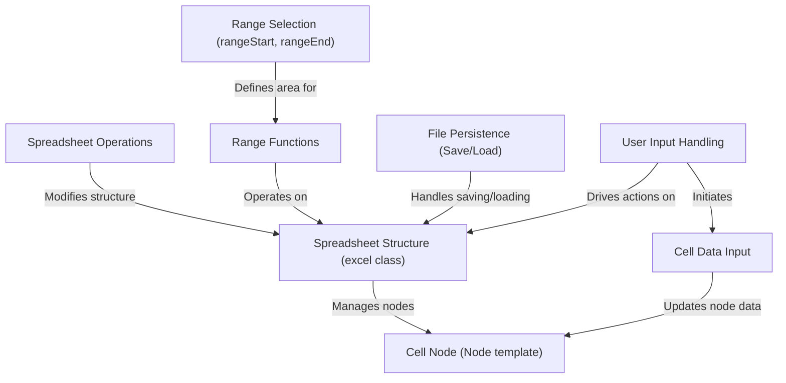
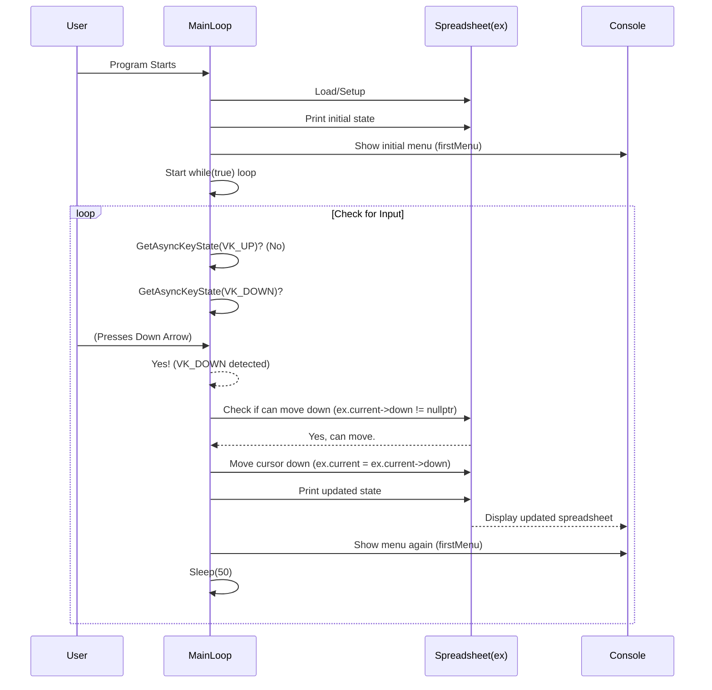
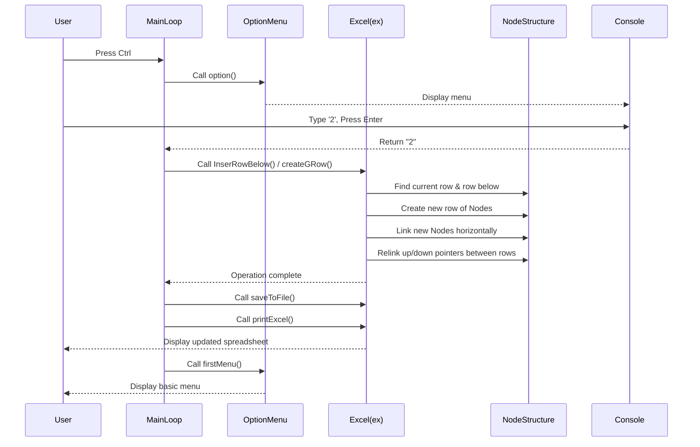
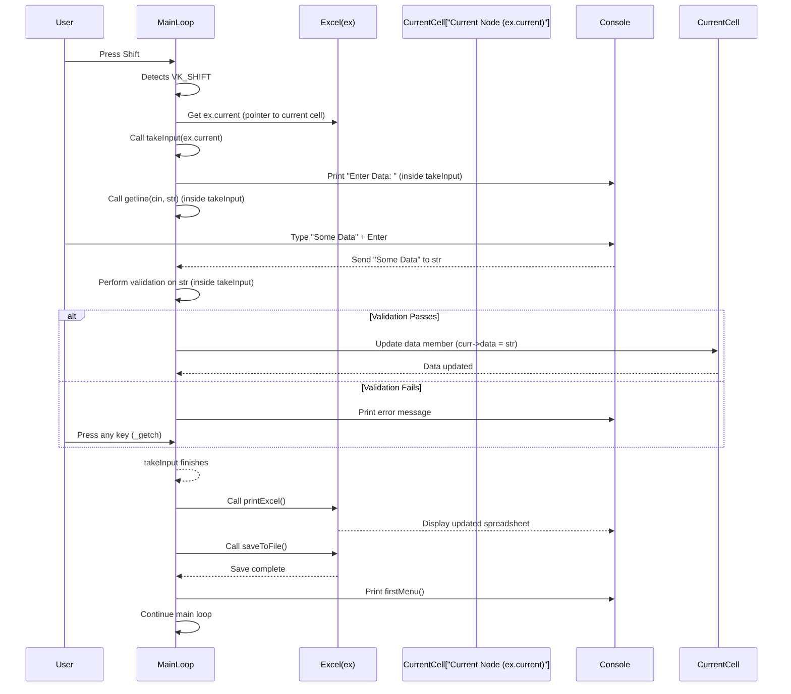
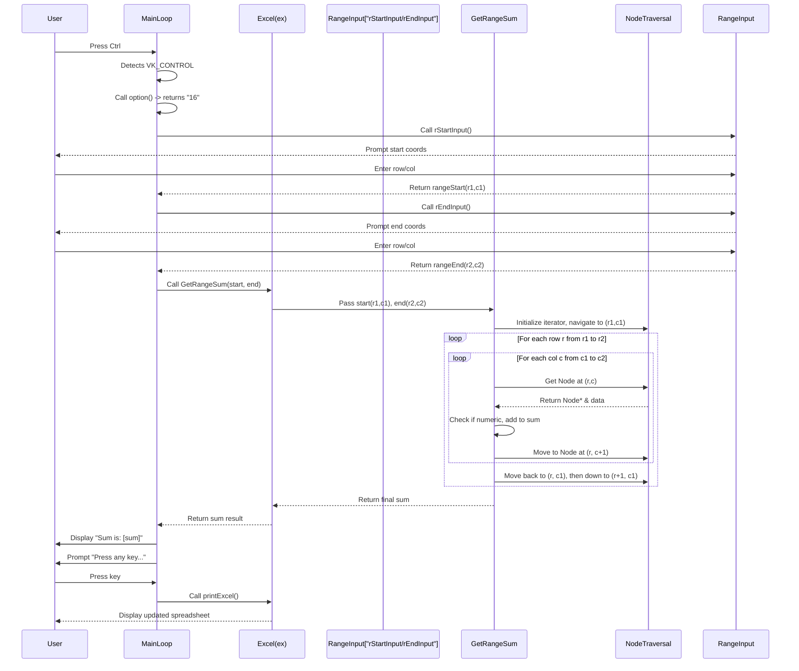
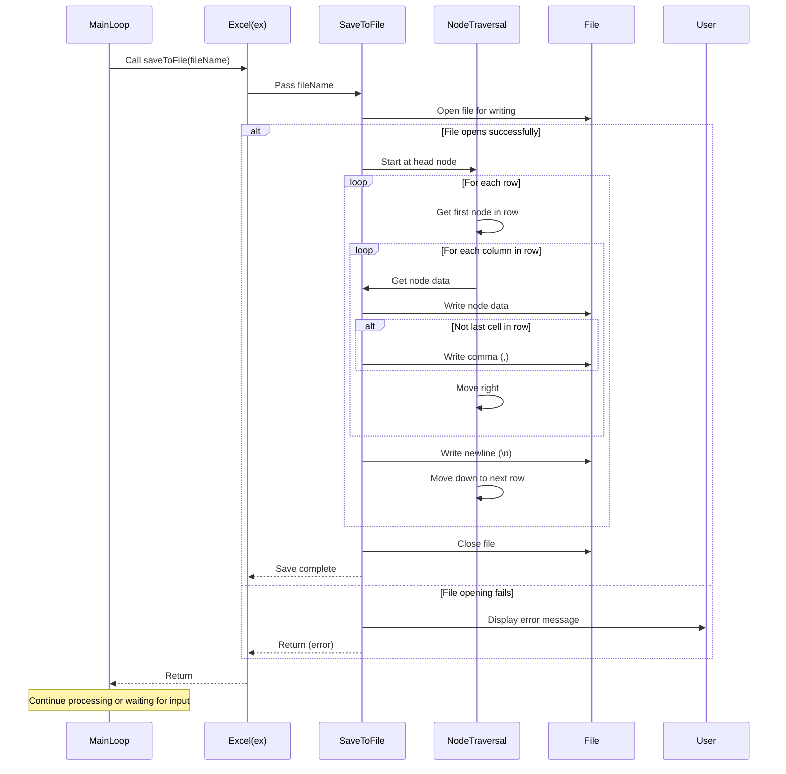
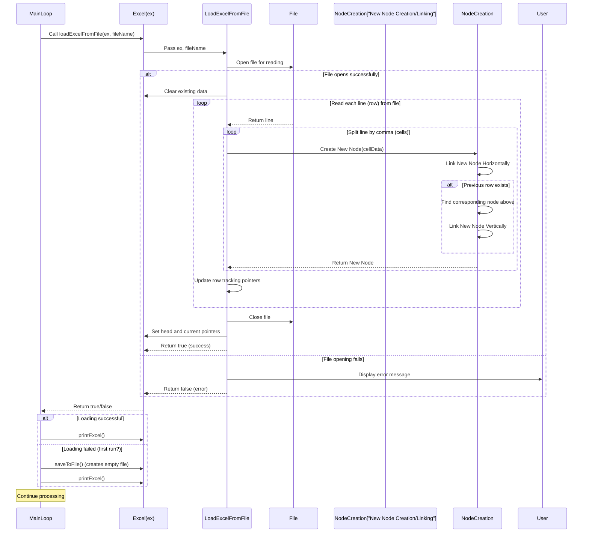
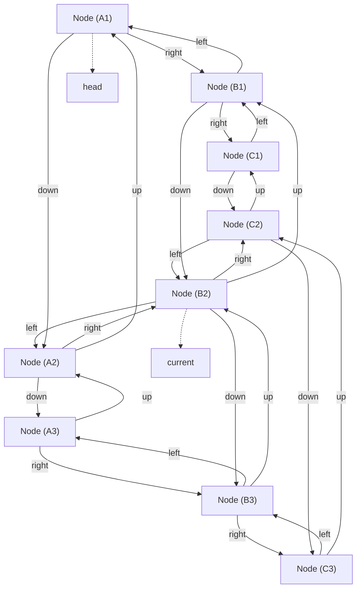

# Tutorial: Cli_Excel_Cpp

This project is a command-line application that simulates a basic spreadsheet.
It allows users to navigate a grid of **cells**, enter **data**, perform various
**spreadsheet operations** like inserting or deleting rows/columns, work with
selected **ranges** of cells for calculations (**range functions**), and
**save/load** their work to/from a file using **file persistence**. **User input handling**
interprets keyboard actions to drive these functions.


## Visual Overview



## Chapters

1. [User Input Handling
](01_user_input_handling_.md)
2. [Spreadsheet Structure (excel class)
](02_spreadsheet_structure__excel_class__.md)
3. [Spreadsheet Operations
](03_spreadsheet_operations_.md)
4. [Cell Data Input
](04_cell_data_input_.md)
5. [Range Selection (rangeStart, rangeEnd)
](05_range_selection__rangestart__rangeend__.md)
6. [Range Functions
](06_range_functions_.md)
7. [File Persistence (Save/Load)
](07_file_persistence__save_load__.md)
8. [Cell Node (Node template)
](08_cell_node__node_template__.md)

---
# Chapter 1: User Input Handling

Welcome to the very first chapter of our tutorial for `Cli_Excel_Cpp`! In this chapter, we'll explore how our simple spreadsheet program listens to you, the user, and understands what you want it to do. Think of this as the program's "ears" and "brain" for understanding commands from your keyboard.

### Why Input Handling?

Imagine you're using a spreadsheet program. What's the first thing you do? You probably move the cursor, type something into a cell, or click on a menu item. How does the program know you want to do these things? It listens!

Our program runs in a command-line window, so it doesn't have a mouse or fancy buttons like a graphical spreadsheet. Instead, it listens for specific key presses on your keyboard. This part of the code is crucial because it's the bridge between you and the spreadsheet data. It takes your keystrokes, figures out the command, and then tells the rest of the program what to do.

Our main goal in this chapter is to understand how the program detects which keys you're pressing and decides what action to take, like moving the cursor around the spreadsheet.

### Listening to Your Keys

Our program needs a way to constantly check if you've pressed a key. It does this by running a loop forever (or until you tell it to stop). Inside this loop, it repeatedly asks the operating system: "Hey, was the Up Arrow key pressed just now? How about the Shift key? Or maybe the Ctrl key?"

The `Source.cpp` file contains the main logic for this listening process. Let's look at the core loop:

```cpp
int main()
{
	// ... (setup code omitted)

	while (true) // This loop runs continuously
	{
		// Check for different key presses here...

		Sleep(50); // Wait a little bit so we don't check too fast
	}
	return 0;
}
```

This `while(true)` loop is the heart of our input handling. It keeps running as long as the program is open.

### What Keys Does it Listen For?

Our program listens for several important keys:

| Key             | Purpose                                  |
| :-------------- | :--------------------------------------- |
| **Up Arrow**    | Move cursor up one cell                  |
| **Down Arrow**  | Move cursor down one cell                |
| **Left Arrow**  | Move cursor left one cell                |
| **Right Arrow** | Move cursor right one cell               |
| **Shift**       | Enter data into the current cell         |
| **Control (Ctrl)** | Show a menu of advanced options and wait for a number input |
| **Escape (Esc)** | Exit the program                         |

### How It Detects Key Presses

Inside that `while(true)` loop, the program uses a function called `GetAsyncKeyState`. This function is like asking the system, "Is this specific key currently being held down or has it been pressed since the last check?"

Here's a simplified look at how it checks for keys:

```cpp
	while (true)
	{
		// Check if Up Arrow is pressed AND if we can move up
		if (GetAsyncKeyState(VK_UP) and ex.current->up != nullptr)
		{
			ex.current = ex.current->up; // Move the cursor
			// ... then update the screen and menu
		}
		// Check if Down Arrow is pressed AND if we can move down
		else if (GetAsyncKeyState(VK_DOWN) and ex.current->down != nullptr)
		{
			ex.current = ex.current->down; // Move the cursor
			// ... then update the screen and menu
		}
		// ... similar checks for LEFT and RIGHT arrows ...
		else if (GetAsyncKeyState(VK_SHIFT)) // Check if Shift is pressed
		{
			takeInput(ex.current); // Call function to get data for the cell
			// ... then update the screen, save, and show menu
		}
		else if (GetAsyncKeyState(VK_CONTROL)) // Check if Control is pressed
		{
			input = option(); // Call function to show menu and get choice
			// ... then handle the chosen option ...
		}
		else if (GetAsyncKeyState(VK_ESCAPE)) // Check if Escape is pressed
		{
			break; // Exit the while(true) loop
		}

		Sleep(50); // Wait a little bit
	}
```

This chain of `if`/`else if` statements is how the program decides what you want to do. It checks one key after another. If it finds a key that's pressed, it performs the action linked to that key and then continues the loop.

After performing an action (like moving the cursor or entering data), the program typically calls `ex.printExcel()` to update what you see on the screen and `firstMenu()` to show you the basic options again. It also often calls `ex.saveToFile()` to make sure your changes aren't lost (we'll learn more about printing and saving in [Spreadsheet Structure](02_spreadsheet_structure__excel_class__.md) and [File Persistence](07_file_persistence__save_load__.md)).

The `Sleep(50)` call is important. It tells the program to pause for 50 milliseconds before checking the keys again. This prevents the loop from running millions of times per second, which would use too much of your computer's power.

### Getting Data and Menu Choices

When you press **Shift**, the program needs to get the data you want to type into the cell. It does this by calling the `takeInput` function. This function pauses the key-checking loop and waits for you to type text and press Enter.

```cpp
template <typename T>
void takeInput(Node<T>* curr)
{
	string str;
	cout << "Enter Data: ";
	getline(cin, str); // Wait for you to type a whole line and press Enter
	// ... (validation code omitted for simplicity)
	curr->data = str; // Store the data in the current cell
	str.clear();
};
```

Similarly, when you press **Ctrl**, the program calls the `option()` function. This function displays a numbered list of available actions (like inserting rows or columns) and then waits for you to type a number and press Enter using `cin >> str;`.

```cpp
string option()
{
	string str;
	// ... print the menu options ...
	cout << "Select Options : ";
	cin >> str; // Wait for you to type a number and press Enter
	return str; // Return the chosen number
}
```

So, while arrow keys, Shift, and Escape are detected by constantly checking `GetAsyncKeyState` in the main loop, the program switches to a different way of getting input (`getline` or `cin`) when you trigger the data entry or menu options with Shift or Ctrl.

### How it Works Step-by-Step (Simple Example)

Let's trace what happens when you start the program and press the Down Arrow key once:



In this diagram:
*   The `User` is you.
*   `MainLoop` represents the `while(true)` loop in `main()`.
*   `Spreadsheet(ex)` represents the `excel` object holding your data (we'll cover this in [Spreadsheet Structure](02_spreadsheet_structure__excel_class__.md)).
*   `Console` is the command-line window where you see the output and type.

The `MainLoop` is constantly running, checking keys. When it detects the Down Arrow, it interacts with the `ex` object to move the internal cursor representation and then updates the console display.

### Summary

User Input Handling is the fundamental layer that allows you to interact with the `Cli_Excel_Cpp` program. It involves:

1.  A continuous loop (`while(true)`) that keeps the program running and listening.
2.  Checking specific key presses using `GetAsyncKeyState` (for movement, Shift, Ctrl, Esc).
3.  Calling appropriate functions based on the key pressed (e.g., moving the cursor, showing a menu, taking cell input).
4.  Using `getline` or `cin` when more complex input like text data or menu numbers is needed.

This input handling system is the trigger for almost everything else that happens in the program. Once a command is understood, it calls other parts of the code to actually perform the spreadsheet operations.

Now that we understand how the program listens to you, the next step is to understand *what* it's operating on – the spreadsheet itself and its structure.

Let's move on to learn about the core data structure that holds all the cells and their data: [Spreadsheet Structure (excel class)](02_spreadsheet_structure__excel_class__.md).

---

<sub><sup>Generated by [AI Codebase Knowledge Builder](https://github.com/The-Pocket/Tutorial-Codebase-Knowledge).</sup></sub> <sub><sup>**References**: [[1]](https://github.com/ABDULQAYYUMRAJPOOT208/Cli_Excel_Cpp/blob/5556c646134dad53d0f5fc27731f06b7e2dec51a/Source.cpp)</sup></sub>
# Chapter 2: Spreadsheet Structure (excel class)

Welcome back! In [Chapter 1: User Input Handling](01_user_input_handling_.md), we learned how our `Cli_Excel_Cpp` program listens to your keystrokes and decides what action to take, like moving the cursor or getting ready for data input. But what exactly is it moving the cursor *on*? Where does the data you type *go*?

This is where the "Spreadsheet Structure" comes in. Just like a real Excel workbook needs pages, rows, and columns to hold your numbers and text, our program needs a way to organize all its data.

### The Blueprint: The `excel` Class

Think of the `excel` class as the central brain and blueprint for your entire spreadsheet in `Cli_Excel_Cpp`. It doesn't just hold data; it *manages* the entire grid of cells. Everything about the spreadsheet's layout and state is controlled here.

Why do we need a single class for this? Because the spreadsheet isn't just a bunch of independent boxes. Cells are related to each other (up, down, left, right), the program needs to know the overall size (how many rows and columns), and it needs to keep track of which cell you are currently interacting with. The `excel` class wraps all these pieces together.

Its main jobs are:
*   Holding all the individual cells.
*   Knowing the total number of rows and columns.
*   Keeping track of the currently selected cell (where your cursor is).
*   Providing ways to perform actions on the spreadsheet (like adding rows, which we'll see in the next chapter).

### Building Blocks: Nodes and the Grid

Our spreadsheet isn't like a simple list. It's a two-dimensional grid. To represent this, `Cli_Excel_Cpp` uses something called a "Node". We'll dive deep into the `Node` class itself in [Chapter 8: Cell Node (Node template)](08_cell_node__node_node_template__.md), but for now, just picture each cell in the spreadsheet as a `Node`.

Each `Node` (cell) holds:
1.  The actual data (the text or number you type).
2.  Pointers that connect it to its neighbors:
    *   A pointer to the `Node` **above** it (`up`).
    *   A pointer to the `Node` **below** it (`down`).
    *   A pointer to the `Node` to its **left** (`left`).
    *   A pointer to the `Node` to its **right** (`right`).

The `excel` class uses these `Node`s to build and maintain the entire grid structure. It essentially creates a large network of interconnected `Node`s.

### Key Pointers within `excel`

The `excel` class keeps track of a few crucial `Node` pointers:

*   `head`: This pointer always points to the very first cell in the spreadsheet – the one in the top-left corner (like cell A1 in Excel). It's the starting point for navigating the whole grid.
*   `current`: This is the most important pointer for user interaction. It always points to the cell where your cursor is currently located. When you press an arrow key, this is the pointer that gets updated.
*   `ex`: This pointer is also often used, especially during the initial creation of the grid. You might see it used interchangeably with `head` or `current` in different parts of the code, but conceptually, `head` and `current` are the most consistently used for representing the top-left and active cell, respectively.

Let's look at how these are declared in the `excel` class in `Header.h`:

```cpp
template <typename T>
class excel
{
public:
	Node<T>* ex;      // Another pointer often used during creation
	Node<T>* head;    // Points to the top-left cell
	Node<T>* current; // Points to the currently selected cell
	int rows, columns; // Stores spreadsheet dimensions
	// ... other members and functions ...
};
```
This snippet shows the essential members. The `rows` and `columns` integers simply keep track of the total size of the grid.

### How `excel` Manages Cursor Movement

Remember from Chapter 1 that pressing an arrow key triggered code like this:

```cpp
// From Source.cpp main loop
if (GetAsyncKeyState(VK_DOWN) and ex.current->down != nullptr)
{
	ex.current = ex.current->down; // Move the cursor down
	// ... update display ...
}
```

This code directly uses the `excel` object (`ex`).
*   `ex.current`: Accesses the `current` pointer managed by the `excel` object.
*   `ex.current->down`: Follows the `down` pointer *from* the cell that `current` currently points to.
*   `ex.current = ex.current->down;`: This is the magic! It updates the `excel` object's `current` pointer to now point to the cell that was below the previous `current` cell. This is how the program "moves" the cursor internally.

Let's visualize this simple movement using a diagram:

```mermaid
sequenceDiagram
    participant User
    participant MainLoop
    participant Excel(ex)
    participant CurrentCell["Cell A1 (ex.current)"]
    participant NextCell["Cell A2 (A1->down)"]

    User->>MainLoop: Press Down Arrow Key
    MainLoop->>MainLoop: Detects VK_DOWN
    MainLoop->>Excel(ex): Check if ex.current->down is not nullptr
    Excel(ex)-->>CurrentCell: Access current cell
    CurrentCell-->>NextCell: Check down pointer
    NextCell-->>Excel(ex): Returns pointer to Cell A2
    Excel(ex)-->>MainLoop: Returns pointer to Cell A2
    MainLoop->>Excel(ex): Update ex.current = (pointer to Cell A2)
    Excel(ex)-->>NextCell: ex.current now points here
    MainLoop->>Excel(ex): Call printExcel()
    Excel(ex)-->>User: Display updated spreadsheet (cursor on A2)
    Note over MainLoop: Loop continues, checks next key press
```
This diagram shows how the user's action triggers the main loop, which then interacts with the `excel` object to change its internal state (`ex.current`) based on the connections between the `Node`s. The `printExcel()` function (also part of the `excel` class) knows how to traverse this grid from the `head` and display it, highlighting the `current` cell.

### Displaying the Spreadsheet (`printExcel`)

The `excel` class also contains the logic to display the grid on your console. Look for the `printExcel()` function within the `excel` class definition in `Header.h`.

```cpp
// Inside the excel class in Header.h
void printExcel()
{
    // Clears the screen
    system("cls");

    // Starts from the top-left cell (head)
    Node<T>* temp = head;

    // Loop through rows
    while (temp != nullptr)
    {
        Node<T>* current = temp; // Start from the first cell in the current row

        // Loop through columns in the current row
        while (current != nullptr)
        {
            // Print cell borders and data
            // ... (border drawing code) ...

            // Check if this cell is the currently selected one
            if (current == this->current)
            {
                // ... (code to print data with highlight color) ...
            }
            else
            {
                // ... (code to print data without highlight) ...
            }

            current = current->right; // Move to the next cell in the row
        }
        // ... (end of row border) ...

        temp = temp->down; // Move to the first cell of the next row
    }
    // ... (bottom border) ...
}
```
This simplified version shows the core idea: `printExcel` starts at `head`, goes right across the first row using `right` pointers, then moves down to the start of the next row using the `down` pointer from the first cell of the previous row, and repeats. It compares each cell's address (`current`) to the `excel` object's `this->current` pointer to know whether to highlight it.

### Initializing the Spreadsheet

When the program starts, the `excel` object is created. Its constructor (`excel()`) contains code to build the initial empty grid, typically a small default size (like 5x5 in the provided code). This involves creating the first `Node`s and linking them together using the `up`, `down`, `left`, and `right` pointers. Functions like `createFirstRow()` and `createGRow()` (also within the `excel` class) handle this initial grid construction.

```cpp
// Inside the excel class in Header.h
excel() : rows(0), columns(0), ex(nullptr), head(nullptr), current(nullptr)
{
    createFirstRow(); // Create the first row of cells
    for (int i = 2; i <= 5; i++)
    {
        createGRow(); // Create subsequent rows
    }
    rows = columns = 5; // Set the initial dimensions
    // current is likely set to head implicitly or explicitly after creation
}
```
This shows that when an `excel` object is born, it immediately builds a small grid, ready for interaction.

### Summary

The `excel` class is the backbone of our spreadsheet application. It acts as the central manager, holding and organizing all the cell data within a grid of interconnected `Node`s. It keeps track of the spreadsheet's dimensions and, critically, the currently selected cell via the `current` pointer. All operations you perform, from moving the cursor to entering data or manipulating rows/columns, interact with and modify this core `excel` structure.

Now that we understand how the spreadsheet is structured internally, we can move on to learning about the specific actions and operations we can perform on this structure.

Let's explore what we can do with our spreadsheet grid in the next chapter: [Spreadsheet Operations](03_spreadsheet_operations_.md).

---

<sub><sup>Generated by [AI Codebase Knowledge Builder](https://github.com/The-Pocket/Tutorial-Codebase-Knowledge).</sup></sub> <sub><sup>**References**: [[1]](https://github.com/ABDULQAYYUMRAJPOOT208/Cli_Excel_Cpp/blob/5556c646134dad53d0f5fc27731f06b7e2dec51a/Header.h), [[2]](https://github.com/ABDULQAYYUMRAJPOOT208/Cli_Excel_Cpp/blob/5556c646134dad53d0f5fc27731f06b7e2dec51a/Source.cpp)</sup></sub>
# Chapter 3: Spreadsheet Operations

Welcome back! In [Chapter 1: User Input Handling](01_user_input_handling_.md), we learned how our `Cli_Excel_Cpp` program listens to your keystrokes. In [Chapter 2: Spreadsheet Structure (excel class)](02_spreadsheet_structure__excel_class__.md), we explored the `excel` class, which holds and manages the grid of cells (Nodes) that make up our spreadsheet.

Now, it's time to learn how we actually *change* that spreadsheet grid. Moving the cursor (as we saw in Chapter 1) lets you navigate the grid, and entering data (coming in Chapter 4) changes the *content* of a cell. But what if you need more rows or columns? What if you want to remove a whole row of data? That's where **Spreadsheet Operations** come in.

### What are Spreadsheet Operations?

Think of these as the tools you'd find in menus like "Insert" or "Delete" in a graphical spreadsheet program like Excel. They are actions that change the fundamental structure of your sheet or clear large sections of it.

In `Cli_Excel_Cpp`, these operations include things like:

*   Adding a new row (above or below the current row).
*   Adding a new column (left or right of the current column).
*   Deleting an entire row or column.
*   Clearing all the content in a row or column (without deleting the row/column itself).
*   Inserting or deleting individual cells, shifting other cells around.

These operations directly modify the network of linked `Node`s managed by the `excel` object.

### How Do You Trigger Operations?

As we saw in Chapter 1, pressing the **Control (Ctrl)** key brings up a menu of advanced options. Most of the spreadsheet operations are accessed through this menu.

When you press **Ctrl**, the program calls the `option()` function (from `Source.cpp`) which displays a numbered list of available actions. You then type the number corresponding to the operation you want and press Enter.

Here's a snippet from the `main` loop in `Source.cpp` that shows how this works:

```cpp
// From Source.cpp main loop
else if (GetAsyncKeyState(VK_CONTROL)) // Check if Control is pressed
{
	input = option(); // Call function to show menu and get choice

	if (input == "2") // User typed '2'
	{
		ex.createGRow(); // Call function to insert row below
	}
	else if (input == "3") // User typed '3'
	{
		ex.createRowUp(); // Call function to insert row above
	}
	// ... other options handled here ...

	ex.saveToFile(fileName); // Save changes (Chapter 7)
	ex.printExcel(); // Update display (Chapter 2)
	firstMenu(); // Show basic menu again
}
```

This code shows that your choice from the menu (`input`) is used to decide which specific function within the `excel` object (`ex`) to call.

### Example: Inserting a Row Below

Let's take a common use case: you have data in your spreadsheet, and you need to add a new, empty row right below the row your cursor is currently in.

In `Cli_Excel_Cpp`, you would:

1.  Use the arrow keys (Chapter 1) to move your cursor to any cell in the row *above* where you want the new row to appear.
2.  Press the **Control (Ctrl)** key. The advanced menu appears.
3.  Look at the menu options displayed in the console. Find the option for "insert a Row below current Cell". According to the `option()` function in `Source.cpp`, this is option **2**.
4.  Type `2` and press Enter.

The program will then perform the operation. You will see the spreadsheet redraw with a new row inserted just below the row your cursor was in.

### How "Insert Row Below" Works Internally

Remember from Chapter 2 that our spreadsheet is a grid of `Node`s linked by `up`, `down`, `left`, and `right` pointers. Inserting a row means creating a whole new horizontal chain of `Node`s and carefully connecting them into the existing grid.

Here's a simplified step-by-step idea of what the `InserRowBelow()` function (or `createGRow()` which seems to do this in the initial code) inside the `excel` class does:

1.  **Find the Current Row:** It figures out which row the `current` pointer is in.
2.  **Find the Row Below (if any):** It also needs to know about the row that is currently below the target row.
3.  **Create New Nodes:** It creates a new `Node` for each column needed for the new row, initializing them with "NIL" data.
4.  **Link New Nodes Horizontally:** It links these new nodes together using their `left` and `right` pointers to form a horizontal chain (the new row).
5.  **Link New Nodes Vertically:** This is the crucial part. For each new node:
    *   It connects its `up` pointer to the corresponding node in the row *above* (the target row).
    *   It connects the corresponding node in the row above's `down` pointer to the new node.
    *   If there was a row *below*, it connects the new node's `down` pointer to the corresponding node in the row below.
    *   It connects the corresponding node in the row below's `up` pointer to the new node.
6.  **Update Row Count:** It increases the `rows` counter in the `excel` object.

Let's visualize this process with a simplified diagram:



This shows how the user input (Ctrl + menu choice) is processed by the main loop, which then tells the `excel` object to perform the specific operation, modifying its internal `Node` structure.

### Looking at the Code (`InserRowBelow`)

The actual code for `InserRowBelow()` in `Header.h` is a bit more complex to handle all the pointer connections correctly, especially edge cases. Here's a simplified snippet focusing on the core idea of connecting the new row vertically:

```cpp
// Simplified snippet from excel class in Header.h
void InserRowBelow()
{
    Node<T>* currentRowStart = current; // Start from current cell
    while (currentRowStart->left != nullptr) // Find the first cell in the current row
    {
        currentRowStart = currentRowStart->left;
    }

    Node<T>* nodeInCurrentRow = currentRowStart;
    Node<T>* previousNewNode = nullptr; // To link new nodes horizontally

    // Loop across the current row
    while (nodeInCurrentRow != nullptr)
    {
        Node<T>* newNode = new Node<T>("NIL"); // Create a new cell for the new row

        // Link new node to node above (in the current row)
        newNode->up = nodeInCurrentRow;
        nodeInCurrentRow->down = newNode;

        // Link new node to node below (if a row exists below)
        if (nodeInCurrentRow->down != nullptr) // nodeInCurrentRow->down is now the NEW node
        {
            Node<T>* nodeBelow = nodeInCurrentRow->down->down; // This finds the *original* node below
            if (nodeBelow != nullptr)
            {
                newNode->down = nodeBelow;
                nodeBelow->up = newNode;
            }
        }

        // Link new node horizontally to the previous new node in the new row
        if (previousNewNode != nullptr)
        {
            previousNewNode->right = newNode;
            newNode->left = previousNewNode;
        }
        previousNewNode = newNode;

        // Move to the next cell in the current row
        nodeInCurrentRow = nodeInCurrentRow->right;
    }
    rows++; // Don't forget to update the row count!
}
```

This code iterates through the cells of the *current* row (`nodeInCurrentRow`). For each cell, it creates a `newNode` and carefully sets its `up` and `down` pointers to link it between `nodeInCurrentRow` and whatever was originally below `nodeInCurrentRow`. It also links the `newNode` to the `previousNewNode` to form the horizontal chain.

Other operations like `createRowUp()`, `insertColumnToRight()`, `deleteColumn()`, `ClearRow()`, etc., work on the same principle: they locate the relevant `Node`s in the grid and modify their `up`, `down`, `left`, and `right` pointers, sometimes deleting nodes or creating new ones, to achieve the desired structural change or content clearing.

### Other Spreadsheet Operations

Here's a quick overview of some other operations available through the Ctrl menu:

| Menu Option | Function Called        | Description                                                                 |
| :---------- | :--------------------- | :-------------------------------------------------------------------------- |
| 2           | `createGRow()` / `InserRowBelow()` | Inserts a new empty row just below the row containing the current cell.     |
| 3           | `createRowUp()`        | Inserts a new empty row just above the row containing the current cell.     |
| 4           | `insertColumnToRight()`| Inserts a new empty column just to the right of the column with the current cell. |
| 5           | `insertColumnToLeft()` | Inserts a new empty column just to the left of the column with the current cell. |
| 12          | `deleteColumn()`       | Deletes the entire column containing the current cell.                      |
| 13          | `deleteRowCurrent()`   | Deletes the entire row containing the current cell.                         |
| 14          | `ClearRow()`           | Sets the data of all cells in the current row to a default empty/zero value. |
| 15          | `ClearColumn()`        | Sets the data of all cells in the current column to a default empty/zero value. |
| 6-11        | `insertCellBy...Shift()`/`deleteCellBy...Shift()` | Insert/delete a single cell, shifting surrounding cells to fill the gap or make space. |

Each of these functions manipulates the `Node` links within the `excel` object to perform its task. After any of these operations, the program automatically saves the changes (Chapter 7) and redraws the spreadsheet (Chapter 2) so you can see the result.

### Summary

Spreadsheet operations are the core actions that allow you to modify the layout and content of your spreadsheet grid beyond just entering data into individual cells. They are triggered via the Ctrl menu and are implemented as methods within the `excel` class. These methods work by carefully creating, deleting, and relinking the `Node`s that form the spreadsheet grid. Understanding these operations is key to using the full functionality of `Cli_Excel_Cpp` for managing your data structure.

Now that we know how to change the structure, let's get back to the data itself. The next chapter will dive into how we handle getting data from the user specifically for putting it *into* a cell.

Let's move on to learn about [Cell Data Input](04_cell_data_input_.md).

---

<sub><sup>Generated by [AI Codebase Knowledge Builder](https://github.com/The-Pocket/Tutorial-Codebase-Knowledge).</sup></sub> <sub><sup>**References**: [[1]](https://github.com/ABDULQAYYUMRAJPOOT208/Cli_Excel_Cpp/blob/5556c646134dad53d0f5fc27731f06b7e2dec51a/Header.h), [[2]](https://github.com/ABDULQAYYUMRAJPOOT208/Cli_Excel_Cpp/blob/5556c646134dad53d0f5fc27731f06b7e2dec51a/Source.cpp)</sup></sub>
# Chapter 4: Cell Data Input

Welcome back to the `Cli_Excel_Cpp` tutorial! In [Chapter 1: User Input Handling](01_user_input_handling_.md), we learned how the program listens for your key presses. In [Chapter 2: Spreadsheet Structure (excel class)](02_spreadsheet_structure__excel_class__.md), we saw how the spreadsheet is organized as a grid of linked cells (Nodes). And in [Chapter 3: Spreadsheet Operations](03_spreadsheet_operations_.md), we explored how to change the structure of this grid (like adding rows or columns).

But what's a spreadsheet without data? The most common thing you'll do is type information *into* the cells. This chapter is all about that essential task: **Cell Data Input**.

### Why Enter Data?

A spreadsheet's primary purpose is to store and organize information. Whether it's numbers, text, dates, or formulas, putting data into the individual cells is the first step to making your spreadsheet useful.

In our command-line program, since we don't have a graphical interface to just click and type, we need a specific way to tell the program: "Okay, I want to put something into the cell where my cursor is right now."

This is the process of cell data input. It involves:
1.  Telling the program you want to enter data.
2.  The program prompting you to type.
3.  You typing the data and pressing Enter.
4.  The program taking that data and putting it into the currently selected cell.

### Triggering Data Input with Shift

As we briefly saw in [Chapter 1: User Input Handling](01_user_input_handling_.md), the `Cli_Excel_Cpp` program is constantly checking which keys you press using `GetAsyncKeyState`. The key assigned to initiate cell data input is the **Shift** key.

When you press **Shift** while the main loop is running, the program detects this and calls a specific function designed to handle getting input from you: the `takeInput` function.

Let's look at the relevant part of the `main` loop in `Source.cpp` again:

```cpp
	while (true)
	{
		// ... checks for arrow keys, Ctrl, Esc ...

		// Check if Shift is pressed
		else if (GetAsyncKeyState(VK_SHIFT))
		{
			takeInput(ex.current); // Call function to get data for the cell
			ex.printExcel();     // Update the display
			ex.saveToFile(fileName); // Save the change
			firstMenu();         // Show basic menu again
		}

		// ... rest of loop ...
	}
```
This shows that when `VK_SHIFT` is detected, the `takeInput` function is called. Notice that it's called with `ex.current` as an argument. This is the `Node` pointer to the cell where your cursor is, managed by the `excel` object (`ex`), as discussed in [Chapter 2: Spreadsheet Structure (excel class)](02_spreadsheet_structure__excel_class__.md). The `takeInput` function needs this so it knows *which* cell's data to update.

After `takeInput` finishes (meaning you've entered your data), the program updates the screen (`ex.printExcel()`) so you can see your change, saves the spreadsheet ([Chapter 7: File Persistence (Save/Load)](07_file_persistence__save_load__.md)), and shows the basic menu again.

### The `takeInput` Function

The `takeInput` function is where the program actually interacts with you to get the cell's content. It pauses the continuous key-checking loop temporarily and waits for you to type a line of text.

Here's the code for the `takeInput` function from `Source.cpp`:

```cpp
template <typename T>
void takeInput(Node<T>* curr)
{
	string str;
	cout << "Enter Data: "; // 1. Prompt the user
	getline(cin, str);      // 2. Read the entire line of input

	// 3. Basic Validation
	if (str == "$$$")
	{
		cout << "This character is not allowed..." << endl;
		cout << "Press any key to continue...";
		_getch(); // Wait for a key press before continuing
	}
	else
	{
		size_t found = str.find(','); // Check for comma
		if (found != string::npos)
		{
			cout << "This character Comma is not allowed..." << endl;
			cout << "Press any key to continue...";
			_getch(); // Wait for a key press
		}
		else
		{
			// 4. Store the data in the cell
			curr->data = str;
			str.clear(); // Clear the input string
		}
	}
};
```

Let's break down what this function does:

1.  **Prompt:** It prints `"Enter Data: "` on the console. This tells you it's ready for you to type.
2.  **Read Input:** `getline(cin, str);` is the key part here. Unlike `cin >> str`, which stops reading at the first space, `getline` reads *everything* you type on a line until you press Enter. This is perfect for cell data, as you might want spaces in your text. The input you type is stored in the `str` variable.
3.  **Basic Validation:**
    *   The code checks if the input `str` is exactly equal to ` "$$$"`.
    *   It also checks if the input `str` *contains* a comma (`,`) using `str.find(',')`. `string::npos` means the comma was not found. If `find` returns anything other than `string::npos`, it means a comma *was* found.
    *   Why are these characters (` $$$ ` and `,`) disallowed? They are likely used internally by the program, perhaps for saving/loading files or marking special cell states. Preventing the user from using them ensures the program's internal logic doesn't get confused.
    *   If either ` "$$$"` or `,` is found, an error message is printed, and `_getch()` is called to pause the program until you press any key, allowing you to read the error before the spreadsheet redraws. The cell's data is *not* updated in this case.
4.  **Store Data:** If the input passes validation, the line `curr->data = str;` is executed. Remember that `curr` is a pointer to the currently selected `Node` (cell). Each `Node` has a `data` member (which is a `string` in this version of the program). This line takes the validated input string (`str`) and assigns it to the `data` member of the current cell. This is how the data gets saved into the spreadsheet structure.
5.  **Clear String:** `str.clear();` empties the temporary `str` variable, ready for the next input.

### Step-by-Step: Entering Data

Let's trace what happens when you want to type "Hello World" into the cell at A1 (assuming your cursor is already there):

1.  Your cursor is on cell A1. The program is in its `while(true)` loop, constantly checking keys.
2.  You press the **Shift** key.
3.  `GetAsyncKeyState(VK_SHIFT)` in the `main` loop detects this.
4.  The condition `GetAsyncKeyState(VK_SHIFT)` becomes true.
5.  The `takeInput(ex.current);` line is executed. `ex.current` points to the A1 `Node`.
6.  Inside `takeInput`:
    *   `"Enter Data: "` is printed to the console.
    *   `getline(cin, str);` is called. The program now pauses, waiting for you to type and press Enter.
7.  You type `Hello World` and press Enter.
8.  The string `"Hello World"` is read by `getline` and stored in the `str` variable.
9.  Validation checks:
    *   Is `str` equal to ` "$$$"`? No.
    *   Does `str` contain `,`? No.
10. The validation passes.
11. `curr->data = str;` is executed. Since `curr` points to the A1 `Node`, the `data` member of the A1 `Node` is updated to `"Hello World"`.
12. `str.clear();` is executed.
13. The `takeInput` function finishes.
14. Execution returns to the `main` loop.
15. `ex.printExcel();` is called. The program redraws the spreadsheet on the console, and you see "Hello World" appear in cell A1.
16. `ex.saveToFile(fileName);` is called, saving your change to the file.
17. `firstMenu();` is called, showing the basic menu options again.
18. The `while(true)` loop continues checking for the next key press.

Here's a simple sequence diagram illustrating this:



This diagram shows how pressing Shift moves the program's focus from the continuous key-checking loop to the specific data input routine, which interacts with the console to get data and then modifies the target cell's internal state.

### Summary

Cell Data Input is the process of putting information into a specific cell. In `Cli_Excel_Cpp`, this is triggered by pressing the **Shift** key, which calls the `takeInput` function. The `takeInput` function prompts you, reads your input using `getline`, performs basic validation to avoid conflict characters like `,` and ` "$$$"`, and if valid, stores the input string directly into the `data` member of the `Node` representing the currently selected cell (`ex.current`). After input is taken (or validation fails and you press a key), the spreadsheet display is updated, and the changes are saved.

This simple interaction allows you to populate your spreadsheet with content, making it ready for calculation or organization.

Now that you know how to put data *into* individual cells, what if you want to perform operations or apply functions to a group of cells? The next chapter will introduce how we define and work with rectangular areas of the spreadsheet.

Let's move on to learn about [Range Selection (rangeStart, rangeEnd)](05_range_selection__rangestart__rangeend__.md).

---

<sub><sup>Generated by [AI Codebase Knowledge Builder](https://github.com/The-Pocket/Tutorial-Codebase-Knowledge).</sup></sub> <sub><sup>**References**: [[1]](https://github.com/ABDULQAYYUMRAJPOOT208/Cli_Excel_Cpp/blob/5556c646134dad53d0f5fc27731f06b7e2dec51a/Source.cpp)</sup></sub>
# Chapter 5: Range Selection (rangeStart, rangeEnd)

Welcome back! In our journey through `Cli_Excel_Cpp`, we've learned how the program listens to your input ([Chapter 1: User Input Handling](01_user_input_handling_.md)), how it organizes data in the spreadsheet grid ([Chapter 2: Spreadsheet Structure (excel class)](02_spreadsheet_structure__excel_class__.md)), how to perform operations that change the structure ([Chapter 3: Spreadsheet Operations](03_spreadsheet_operations_.md)), and how to put data into individual cells ([Chapter 4: Cell Data Input](04_cell_data_input_.md)).

So far, we've mainly dealt with one cell at a time – the one where your cursor (`ex.current`) is. But what if you want to do something to a *group* of cells? Like calculate the total of a column of numbers, find the average of a row, or copy a block of data?

This is where **Range Selection** comes in. It's the concept of defining a specific rectangular area of the spreadsheet so that operations can be applied to *all* the cells within that area, not just one.

### Why Select a Range?

Imagine you have a list of sales figures in cells B2 through B10 and you want to find their sum. You don't want to manually add each cell's value. In a graphical spreadsheet, you'd drag your mouse from B2 to B10 to *select* that range, and then click a "Sum" button.

`Cli_Excel_Cpp` needs a way for you to define that same rectangular area. Instead of dragging a mouse, you'll tell the program where the top-left corner of the rectangle is and where the bottom-right corner is.

Once you've defined this range, you can then apply various **Range Functions** (which we'll cover in the next chapter) to it, such as:

*   Calculating the Sum of all numbers in the range.
*   Finding the Average.
*   Counting how many cells are in the range.
*   Finding the Minimum or Maximum value.
*   Copying or Cutting the data from the range.
*   Pasting data *into* a range (starting from a point).

### Defining the Rectangle: `rangeStart` and `rangeEnd`

To define a rectangle, you need two points: the top-left corner and the bottom-right corner. In `Cli_Excel_Cpp`, these points are specified using row and column numbers, and they are stored in two simple structures (defined as classes in the code): `rangeStart` and `rangeEnd`.

*   **`rangeStart`**: This object holds the row and column number for the **top-left** cell of your selected area. It has two members: `rowStart` and `colStart`.
*   **`rangeEnd`**: This object holds the row and column number for the **bottom-right** cell of your selected area. It has two members: `rowEnd` and `colEnd`.

Let's look at how these simple structures are defined in `Header.h`:

```cpp
// In Header.h

class rangeStart
{
public:
	int rowStart, colStart;

	rangeStart(int s, int e) : rowStart(s), colStart(e) {}
};

class rangeEnd
{
public:
	int rowEnd, colEnd;
	rangeEnd(int re, int ce) : rowEnd(re), colEnd(ce) {}
};
```
As you can see, they are very straightforward. Each is a small container holding just two integer values. The constructor (`rangeStart(int s, int e)`) is a quick way to create an object and immediately set its `rowStart`/`colStart` or `rowEnd`/`colEnd` values when you create it.

### How You Specify a Range

Just like other advanced operations in `Cli_Excel_Cpp`, range functions are triggered via the **Control (Ctrl)** key menu ([Chapter 1: User Input Handling](01_user_input_handling_.md), [Chapter 3: Spreadsheet Operations](03_spreadsheet_operations_.md)).

When you select a menu option that operates on a range (like Sum, Average, Copy, etc., options 16 through 23 in the `option()` menu), the program needs to ask you for the range coordinates. It does this by calling helper functions: `rStartInput()` and `rEndInput()`.

Here's a snippet from `Source.cpp` showing how these are called when you choose option `16` (Sum):

```cpp
// From Source.cpp main loop (simplified)
else if (GetAsyncKeyState(VK_CONTROL)) // Check if Control is pressed
{
    input = option(); // Show menu, get choice

    // ... other options 2-15 ...

    else if (input == "16") // User wants Sum
    {
        rangeStart start = rStartInput(); // Ask for top-left corner
        rangeEnd end = rEndInput();       // Ask for bottom-right corner

        // Now call the function using the defined range
        cout << "Sum is: " << ex.GetRangeSum(start, end) << endl;

        cout << "Press any key to continue...";
        _getch(); // Wait for user
    }
    // ... other range options 17-23 ...

    ex.saveToFile(fileName);
    ex.printExcel();
    firstMenu();
}
```
This shows that before calling `ex.GetRangeSum()`, the program first obtains the necessary `rangeStart` and `rangeEnd` objects by calling `rStartInput()` and `rEndInput()`.

### Getting the Range Coordinates (rStartInput, rEndInput)

The `rStartInput()` and `rEndInput()` functions are simple command-line prompts that ask you for the row and column numbers for the start and end of your range.

Let's look at their code from `Source.cpp`:

```cpp
// From Source.cpp

rangeStart rStartInput()
{
	char r, c;
	cout << "Enter starting row: ";
	cin >> r; // Read character for row
	cout << "Enter starting column: ";
	cin >> c; // Read character for column

	// Basic validation and conversion (handles single digits 1-9)
	if (isdigit(c) and isdigit(r))
	{
		int row = r - '0'; // Convert char '1' to int 1, '2' to 2, etc.
		int col = c - '0';
		return rangeStart(row, col); // Create and return rangeStart object
	}
	else
	{
		return rangeStart(0, 0); // Return invalid range if input is not a digit
	}
}

rangeEnd rEndInput()
{
	char r, c;
	cout << "Enter ending row: ";
	cin >> r; // Read character for row
	cout << "Enter ending column: ";
	cin >> c; // Read character for column

	// Basic validation and conversion (handles single digits 1-9)
	if (isdigit(c) and isdigit(r))
	{
		int row = r - '0'; // Convert char '1' to int 1, '2' to 2, etc.
		int col = c - '0';
		return rangeEnd(row, col); // Create and return rangeEnd object
	}
	else
	{
		return rangeEnd(0, 0); // Return invalid range if input is not a digit
	}
}
```
These functions pause and wait for you to type a *single digit* for the row and a single digit for the column, and press Enter after each. They perform a basic check to make sure the input characters are digits and convert them into integers. These integers are then used to create the `rangeStart` or `rangeEnd` object, which is returned.

**Example Interaction:**

If you wanted to select the range from row 2, column 3 (top-left) to row 4, column 5 (bottom-right) for a Sum function:

1.  Press **Ctrl**.
2.  Select option **16** (Sum).
3.  Program asks: `Enter starting row: `
4.  You type `2` and press Enter.
5.  Program asks: `Enter starting column: `
6.  You type `3` and press Enter. (`rStartInput` returns `rangeStart(2, 3)`)
7.  Program asks: `Enter ending row: `
8.  You type `4` and press Enter.
9.  Program asks: `Enter ending column: `
10. You type `5` and press Enter. (`rEndInput` returns `rangeEnd(4, 5)`)
11. The program now has `start = rangeStart(2, 3)` and `end = rangeEnd(4, 5)`.
12. It calls `ex.GetRangeSum(start, end)`.

### How the Program Uses the Range Internally

Once the program has the `rangeStart` and `rangeEnd` objects, the functions that operate on ranges (like `GetRangeSum`, `RangeCopySelect`, etc., within the `excel` class) use these coordinates to figure out which `Node`s (cells) are part of the selected area.

Remember from [Chapter 2: Spreadsheet Structure](02_spreadsheet_structure__excel_class__.md) that the spreadsheet is a grid of `Node`s connected by `up`, `down`, `left`, and `right` pointers, starting from `head`.

To process a range, a function like `GetRangeSum` needs to:

1.  **Find the starting cell:** Starting from the `head` node (row 1, col 1), it navigates `start.rowStart - 1` steps down and `start.colStart - 1` steps right to reach the top-left cell of the range.
2.  **Iterate through the range:** Once at the starting cell, it needs to visit *every* cell in the rectangle defined by the start and end coordinates. This usually involves nested loops:
    *   An outer loop for rows (from `start.rowStart` to `end.rowEnd`).
    *   An inner loop for columns (from `start.colStart` to `end.colEnd`).
3.  **Perform the action:** Inside the inner loop, for each cell it visits, it performs the desired action (e.g., add its data to a running total, add its data to a copy buffer, etc.).

The `excel` class has a helper class called `iiterator` which is intended to help navigate the grid. The range functions use this iterator, initialized at `head`, and then move it to the starting cell of the range before looping.

Here's a simplified look at the traversal part within `GetRangeSum`:

```cpp
// Simplified snippet from excel::GetRangeSum in Header.h

double GetRangeSum(rangeStart start, rangeEnd end)
{
    double sum = 0;
    iiterator iterator(this->head); // Start iterator at the top-left (head)

    // 1. Navigate to the starting cell of the range
    for (int i = 1; i < start.rowStart; i++) {
        iterator++; // Move down (using overloaded ++ for down)
    }
    for (int i = 1; i < start.colStart; i++) {
        ++iterator; // Move right (using overloaded ++ for right)
    }

    // 2. Iterate through the rows and columns within the range
    for (int row = start.rowStart; row <= end.rowEnd; row++)
    {
        for (int col = start.colStart; col <= end.colEnd; col++)
        {
            // Check if cell exists (iterator.iter is the current Node pointer)
            if (iterator.iter == nullptr) return sum; // Handle cases where range goes out of bounds

            // 3. Perform the action: Check if data is a number and add to sum
            if (isStrDigit(iterator.iter->data)) // isStrDigit checks if data is a number
            {
                sum += stod(iterator.iter->data); // Convert string to double and add
            }

            // Move iterator to the next column in the current row
            ++iterator; // Move right
        }

        // After finishing a row, move iterator back to the start column of the row...
        for (int i = end.colEnd; i >= start.colStart; i--) {
            iterator--; // Move left (using overloaded -- for left)
        }
        // ... and then move down to the start of the next row
        iterator++; // Move down
    }

    return sum;
}
```
This snippet shows the pattern: first, calculate the starting node by moving from the head, then use nested loops and pointer movements (via the iterator) to visit each node within the specified rectangular area defined by `start` and `end`. For each visited node, it checks its data and adds it to the sum if it's a number.

Here's a simplified diagram of the range selection and processing flow:

```mermaid
sequenceDiagram
    participant User
    participant MainLoop
    participant OptionMenu
    participant InputFunctions["rStartInput/rEndInput"]
    participant Excel(ex)
    participant RangeFunction["e.g., GetRangeSum"]
    participant NodeTraversal

    User->>MainLoop: Press Ctrl
    MainLoop->>OptionMenu: Call option()
    OptionMenu-->>Console: Display menu
    User->>Console: Type '16', Press Enter
    Console-->>MainLoop: Return "16"
    MainLoop->>InputFunctions: Call rStartInput()
    InputFunctions-->>Console: Prompt "Enter starting row/col"
    User->>Console: Type '2', '3', Enter
    Console-->>InputFunctions: Return inputs
    InputFunctions-->>MainLoop: Return rangeStart(2,3)
    MainLoop->>InputFunctions: Call rEndInput()
    InputFunctions-->>Console: Prompt "Enter ending row/col"
    User->>Console: Type '4', '5', Enter
    Console-->>InputFunctions: Return inputs
    InputFunctions-->>MainLoop: Return rangeEnd(4,5)
    MainLoop->>Excel(ex): Call GetRangeSum(start, end)
    Excel(ex)->>RangeFunction: Pass rangeStart(2,3), rangeEnd(4,5)
    RangeFunction->>NodeTraversal: Start at head, navigate to (2,3)
    loop For each row (2 to 4)
        loop For each col (3 to 5)
            RangeFunction->>NodeTraversal: Access current Node
            NodeTraversal-->>RangeFunction: Return Node data
            RangeFunction->>RangeFunction: Process data (e.g., add to sum)
            RangeFunction->>NodeTraversal: Move to next Node (right)
        end
        RangeFunction->>NodeTraversal: Move back to start col, then down
    end
    RangeFunction-->>Excel(ex): Return sum result
    Excel(ex)-->>MainLoop: Return sum result
    MainLoop->>Console: Print "Sum is: [result]"
    MainLoop->>Console: Print "Press any key..."
    User->>Console: Press any key
    MainLoop->>Excel(ex): Call saveToFile()
    MainLoop->>Excel(ex): Call printExcel()
    MainLoop->>OptionMenu: Call firstMenu()
    OptionMenu-->>User: Display basic menu
```

This diagram illustrates how the user input defines the range, and then the program's range functions use that definition to navigate and process the appropriate cells within the internal Node structure.

### Summary

Range selection is a crucial concept for performing operations on multiple cells at once in `Cli_Excel_Cpp`. It involves defining a rectangular area using the row and column numbers of its top-left corner (`rangeStart`) and bottom-right corner (`rangeEnd`). These coordinate pairs are stored in simple `rangeStart` and `rangeEnd` objects. The user provides these coordinates via prompts after selecting a range-based function from the Ctrl menu. Internally, functions use these coordinates to navigate the `Node` grid from the `head` and iterate through each cell within the defined rectangle to perform actions like summing values or copying data.

Now that you understand how to define and select a range of cells, you're ready to learn about the specific actions and calculations you can perform on these selected areas.

Let's move on to learn about the available functions that operate on ranges in the next chapter: [Range Functions](06_range_functions_.md).

---

<sub><sup>Generated by [AI Codebase Knowledge Builder](https://github.com/The-Pocket/Tutorial-Codebase-Knowledge).</sup></sub> <sub><sup>**References**: [[1]](https://github.com/ABDULQAYYUMRAJPOOT208/Cli_Excel_Cpp/blob/5556c646134dad53d0f5fc27731f06b7e2dec51a/Header.h), [[2]](https://github.com/ABDULQAYYUMRAJPOOT208/Cli_Excel_Cpp/blob/5556c646134dad53d0f5fc27731f06b7e2dec51a/Source.cpp)</sup></sub>
# Chapter 6: Range Functions

Welcome back to the `Cli_Excel_Cpp` tutorial! In our previous chapters, we've built up a solid understanding of the program: how it listens to you ([Chapter 1: User Input Handling](01_user_input_handling_.md)), how it organizes data ([Chapter 2: Spreadsheet Structure (excel class)](02_spreadsheet_structure__excel_class__.md)), how to modify its structure ([Chapter 3: Spreadsheet Operations](03_spreadsheet_operations_.md)), and how to put data into individual cells ([Chapter 4: Cell Data Input](04_cell_data_input_.md)). Most recently, in [Chapter 5: Range Selection (rangeStart, rangeEnd)](05_range_selection__rangestart__rangeend__.md), we learned how to define a rectangular area of cells using `rangeStart` and `rangeEnd`.

Now, the exciting part! What can we *do* with that selected range? That's where **Range Functions** come in.

### What are Range Functions?

Imagine you have a list of exam scores in a column, and you want to quickly find the highest score or calculate the average. Or maybe you need to copy a block of data from one part of the spreadsheet to another. Doing these things one cell at a time would be incredibly tedious.

Range Functions are operations designed to work on a group of cells that you've specified using range selection. Instead of acting on just the single cell where your cursor is, they process *all* the cells within the defined rectangular area.

Think of them as powerful tools that let you perform calculations, analysis, or data manipulation across a whole section of your spreadsheet with just a few commands.

### Using Range Functions via the Ctrl Menu

Just like the structural spreadsheet operations we saw in [Chapter 3: Spreadsheet Operations](03_spreadsheet_operations_.md), Range Functions in `Cli_Excel_Cpp` are accessed through the advanced menu that appears when you press the **Control (Ctrl)** key.

When you select a menu option corresponding to a Range Function, the program first needs to know *which* range you want to operate on. This is where the `rangeStart` and `rangeEnd` inputs you learned about in [Chapter 5: Range Selection (rangeStart, rangeEnd)](05_range_selection__rangestart__rangeend__.md) are used. The program will prompt you for the starting (top-left) and ending (bottom-right) cell coordinates of the range.

Here's a look at the relevant part of the `main` loop in `Source.cpp` showing how a range function is triggered:

```cpp
// From Source.cpp main loop (simplified)
else if (GetAsyncKeyState(VK_CONTROL)) // Check if Control is pressed
{
    input = option(); // Show menu, get user choice

    // ... menu options 2-15 (structural operations) ...

    else if (input == "16") // User chose Sum function
    {
        // 1. Get the range definition from the user
        rangeStart start = rStartInput(); // Prompts for start row/col
        rangeEnd end = rEndInput();       // Prompts for end row/col

        // 2. Call the range function on the excel object
        cout << "Sum is: " << ex.GetRangeSum(start, end) << endl;

        // 3. Pause so the user can see the output
        cout << "Press any key to continue...";
        _getch();
    }
    // ... other range options (17-23) handled similarly ...

    ex.saveToFile(fileName); // Save changes (Chapter 7)
    ex.printExcel();     // Update display (Chapter 2)
    firstMenu();         // Show basic menu again
}
```

This snippet clearly shows the flow: press Ctrl, choose a numbered option for a range function (like 16 for Sum), the program prompts you for the range using `rStartInput()` and `rEndInput()`, and then it calls the corresponding method on the `excel` object, passing it the `start` and `end` objects that define your selected area.

### Available Range Functions

Here are the primary Range Functions available in `Cli_Excel_Cpp` through the Ctrl menu:

| Menu Option | Function Called           | Description                                                              |
| :---------- | :------------------------ | :----------------------------------------------------------------------- |
| 16          | `GetRangeSum(start, end)` | Calculates and displays the sum of all *numeric* values within the range. |
| 17          | `GetRangeAverage(start, end)`| Calculates and displays the average of all *numeric* values within the range. |
| 18          | `getSelectedCount(start, end)`| Displays the total number of cells in the selected range.                  |
| 19          | `GetRangeMinimum(start, end)`| Finds and displays the minimum *numeric* value within the range.          |
| 20          | `GetRangeMaximum(start, end)`| Finds and displays the maximum *numeric* value within the range.          |
| 21          | `RangeCopySelect(start, end)`| Copies the data from the selected range into a temporary storage (paste buffer). |
| 22          | `paste()`                 | Pastes the data from the temporary storage (copy buffer) into the spreadsheet, starting at the current cell. |
| 23          | `RangeCutSelect(start, end)` | Copies the data from the selected range *and* clears the original cells (like Cut in Excel), storing the data in the paste buffer. |

These functions are all methods belonging to the `excel` class, as they need access to the spreadsheet's structure and data to perform their tasks.

### Example: Calculating the Sum of a Range

Let's walk through the steps you'd take and what happens internally when you use the Sum function (option 16):

1.  **User Action:** You move the cursor to any cell, press **Ctrl**, and choose option **16** (Sum) from the menu.
2.  **Input Range:** The program prompts:
    ```
    Enter starting row:
    Enter starting column:
    Enter ending row:
    Enter ending column:
    ```
    You enter the row and column numbers for the top-left and bottom-right corners of your desired range (e.g., `2`, `3` then `4`, `5`). This creates `rangeStart(2,3)` and `rangeEnd(4,5)`.
3.  **Function Call:** The `main` loop calls `ex.GetRangeSum(rangeStart(2,3), rangeEnd(4,5))`.
4.  **Internal Processing (`GetRangeSum`):**
    *   The `GetRangeSum` function within the `excel` class receives the `start` and `end` objects.
    *   It needs to visit every cell from row 2, column 3 to row 4, column 5.
    *   It starts an `iiterator` at the `head` of the spreadsheet (top-left).
    *   It navigates the iterator down (2-1=1 step) and right (3-1=2 steps) to reach the starting cell of the range (row 2, col 3).
    *   It then enters nested loops: an outer loop for rows (2 to 4) and an inner loop for columns (3 to 5).
    *   Inside the loops, for each cell (`iterator.iter`), it checks if the cell's data (`iterator.iter->data`) can be converted to a number using a helper function like `isStrDigit`.
    *   If it's a number, the string data is converted to a double (`stod`) and added to a running `sum`.
    *   After processing a cell, the iterator moves right to the next cell in the row.
    *   After processing all cells in a row, the iterator moves back to the starting column of that row and then down to the first cell of the next row in the range.
    *   This continues until all cells in the rectangular range have been visited.
    *   The function returns the calculated `sum`.
5.  **Output:** The `main` loop receives the sum and prints it to the console (`Sum is: [calculated sum]`). It then prompts you to press a key before clearing the screen and redrawing the spreadsheet.

Here's a simple sequence diagram for the Sum function:



This diagram shows how the user-defined range parameters guide the `GetRangeSum` function to iterate through the correct portion of the internal Node grid.

### Looking at the Code for Range Functions

Let's look at simplified snippets of some range functions from the `excel` class in `Header.h` to see how they use the range coordinates and traverse the nodes.

**`GetRangeSum` (Simplified):**

```cpp
// Simplified snippet from excel class in Header.h
double GetRangeSum(rangeStart start, rangeEnd end)
{
    double sum = 0;
    iiterator iterator(this->head); // Start at top-left (1,1)

    // Navigate iterator to the STARTING cell of the range
    // (Need to go start.rowStart-1 steps down and start.colStart-1 steps right)
    // ... (navigation code as shown in Chapter 5's internal implementation section) ...

    // Iterate through rows in the range
    for (int row = start.rowStart; row <= end.rowEnd; row++)
    {
        // Iterate through columns in the current row within the range
        for (int col = start.colStart; col <= end.colEnd; col++)
        {
            if (iterator.iter == nullptr) return sum; // Safety check

            // Check if data is numeric and add to sum
            if (isStrDigit(iterator.iter->data)) // Checks if string contains only digits
            {
                sum += stod(iterator.iter->data); // Convert string to double and add
            }

            iterator++; // Move to the RIGHT cell (as defined by iiterator operator++)
        }

        // After finishing a row, reset iterator to the start column of the *next* row
        // (Move left back to start column, then down one row)
        // ... (reset and move down code as shown in Chapter 5's internal implementation section) ...
    }

    return sum;
}
```
This snippet highlights the core logic: get the range, navigate to the start of the range, loop through the specified rows and columns using the iterator, check if the cell data is a number, and add it to the total. The navigation logic using the `iiterator`'s overloaded `++` and `--` operators is key here, allowing movement through the linked list structure based on the row/column numbers.

**`RangeCopySelect` (Simplified):**

```cpp
// Simplified snippet from excel class in Header.h
void RangeCopySelect(rangeStart start, rangeEnd end)
{
    this->pasteVecter.clear(); // Clear any previous copied data
    iiterator iterator(this->head); // Start at top-left (1,1)

    // Navigate iterator to the STARTING cell of the range
    // ... (navigation code) ...

    // Iterate through rows in the range
    for (int row = start.rowStart; row <= end.rowEnd; row++)
    {
        // Iterate through columns in the current row within the range
        for (int col = start.colStart; col <= end.colEnd; col++)
        {
             if (iterator.iter == nullptr) return; // Safety check

            // Copy the data into the pasteVecter
            pasteVecter.push_back(iterator.iter->data);

            iterator++; // Move to the RIGHT cell
        }
        // After a row, add a special marker to separate rows in the vector
        pasteVecter.push_back("$$$");

        // After finishing a row, reset iterator to the start column of the *next* row
        // ... (reset and move down code) ...
    }
    pasteVecter.pop_back(); // Remove the last $$$ marker (optional, but good practice)
}
```
This function follows a similar traversal pattern but instead of calculating a sum, it collects the `data` string from each cell and adds it to a `vector` called `pasteVecter`. The special string `"$$$"` is inserted at the end of each row's data in the vector to remember the original row structure. This `pasteVecter` is then used by the `paste()` function.

**`paste()` (Conceptual):**

The `paste()` function (option 22) is interesting because it doesn't take a range as input. It pastes the data *from* the `pasteVecter` *into* the grid starting at the **current cell** (`ex.current`). It reads the data from the `pasteVecter`, cell by cell. When it encounters the `"$$$"` marker, it knows to move down to the next row in the spreadsheet before continuing to paste the next piece of data. It also includes logic to automatically insert new rows or columns if the pasted data goes beyond the current spreadsheet bounds.

### Range Functions and Data Types

Notice that functions like `GetRangeSum`, `GetRangeAverage`, `GetRangeMinimum`, and `GetRangeMaximum` specifically mention working with *numeric* values. The `isStrDigit` helper function is used to check if a cell's string data looks like a number before attempting to convert it using `stod` (string to double). This prevents errors if you try to sum cells that contain text.

### Summary

Range Functions are powerful tools in `Cli_Excel_Cpp` that allow you to operate on multiple cells at once. They rely on the range defined by `rangeStart` and `rangeEnd` (from [Chapter 5](05_range_selection__rangestart__rangeend__.md)) to identify the target cells. Accessed via the Ctrl menu, these functions (like Sum, Average, Copy, Cut) traverse the `Node` grid within the specified coordinates, performing their specific action on each cell. Functions like Sum/Average handle only numeric data. Copy/Cut operations store data in a temporary vector (`pasteVecter`) which is then used by the `paste` function to insert the data elsewhere.

Understanding Range Functions enables you to perform more complex operations and analysis on your data beyond just single-cell interactions.

Now that we can manipulate the structure and content of our spreadsheet, it's vital to be able to save our work and load it later. The next chapter will cover how `Cli_Excel_Cpp` handles **File Persistence**.

Let's move on to learn about [File Persistence (Save/Load)](07_file_persistence__save_load__.md).

---

<sub><sup>Generated by [AI Codebase Knowledge Builder](https://github.com/The-Pocket/Tutorial-Codebase-Knowledge).</sup></sub> <sub><sup>**References**: [[1]](https://github.com/ABDULQAYYUMRAJPOOT208/Cli_Excel_Cpp/blob/5556c646134dad53d0f5fc27731f06b7e2dec51a/Header.h), [[2]](https://github.com/ABDULQAYYUMRAJPOOT208/Cli_Excel_Cpp/blob/5556c646134dad53d0f5fc27731f06b7e2dec51a/Source.cpp)</sup></sub>
# Chapter 7: File Persistence (Save/Load)

Welcome back! In our journey through `Cli_Excel_Cpp`, we've learned how to interact with the program ([Chapter 1: User Input Handling](01_user_input_handling_.md)), understand its structure ([Chapter 2: Spreadsheet Structure (excel class)](02_spreadsheet_structure__excel_class__.md)), modify the spreadsheet grid ([Chapter 3: Spreadsheet Operations](03_spreadsheet_operations_.md)), enter data into cells ([Chapter 4: Cell Data Input](04_cell_data_input_.md)), define specific areas of the sheet ([Chapter 5: Range Selection (rangeStart, rangeEnd)](05_range_selection__rangestart__rangeend__.md)), and perform functions on those areas ([Chapter 6: Range Functions](06_range_functions_.md)).

You can now build a spreadsheet, add data, insert rows, calculate sums, and much more! But what happens when you close the program? All that hard work would disappear forever!

This is where **File Persistence (Save/Load)** comes in. It's the ability for the program to save the entire current state of your spreadsheet – all the cells, their data, and their layout – into a file on your computer. Later, you can start the program again, and it can load that file back, putting everything exactly where you left it. It's just like clicking "Save" and "Open" in a regular spreadsheet application like Microsoft Excel.

### Why Save and Load?

The main reason is simple: **to keep your data!** Anything you do while the program is running is stored in your computer's temporary memory (RAM). When the program ends, that memory is cleared. By saving to a file (which is stored more permanently on your hard drive), you create a backup of your work.

This abstraction handles two main tasks:
1.  **Saving:** Writing the current spreadsheet data from memory to a file.
2.  **Loading:** Reading spreadsheet data from a file back into memory when the program starts.

### How Saving and Loading Works in `Cli_Excel_Cpp`

`Cli_Excel_Cpp` saves your spreadsheet data into a simple text file, usually named `excel.txt`. This file stores the data in a format that's easy for the program to read back later. The file uses commas (`,`) to separate the data within cells on the same row, and newlines (`\n`) to separate different rows. This is a common format similar to CSV (Comma Separated Values).

The core logic for saving and loading is handled by two methods within the `excel` class:
*   `saveToFile(string file)`: Writes the current spreadsheet state to the specified file.
*   `loadExcelFromFile(excel<T>& myExcel, const string& file)`: Reads data from the specified file and rebuilds the spreadsheet structure in memory.

You'll notice in the `Source.cpp` file that saving often happens automatically after you perform significant actions (like entering data with Shift or choosing a structural/range operation with Ctrl). Loading happens automatically right when the program starts.

### Automatic Saving and Loading in `main`

Let's look at how these functions are called in the `main` function in `Source.cpp`:

```cpp
int main()
{
	string input, fileName = "excel.txt"; // Define filename
	excel<string> ex; // Create the spreadsheet object

    // Attempt to load data from the file
	if(!ex.loadExcelFromFile(ex, fileName));
	{
        // If loading fails (e.g., file doesn't exist yet)
		ex.saveToFile(fileName); // Save an empty initial state
	}

    // Display the spreadsheet (either loaded or new)
	ex.printExcel();
    // Show the initial menu
	firstMenu();

	while (true)
	{
		// ... Input handling for arrow keys, Ctrl, Shift, Esc ...

        // Example: After Shift is pressed and input is taken
        else if (GetAsyncKeyState(VK_SHIFT))
        {
            takeInput(ex.current);
            ex.printExcel();
            ex.saveToFile(fileName); // --- AUTO SAVE HERE ---
            firstMenu();
        }
        // Example: After a Ctrl menu option is processed
        else if (GetAsyncKeyState(VK_CONTROL))
        {
            // ... Handle menu option and perform spreadsheet operation ...
            ex.saveToFile(fileName); // --- AUTO SAVE HERE ---
            ex.printExcel();
            firstMenu();
        }
        // ... rest of loop ...
    }
    // ... program exits when Escape is pressed ...
}
```

This snippet shows:
*   When the program starts, it creates an `excel` object (`ex`).
*   It immediately tries to `loadExcelFromFile`. If this fails (the file `excel.txt` might not exist the very first time you run the program), the `if` condition is true (due to the `;` after the if, which is a potential bug but how the code is written), and it calls `saveToFile` to create a new, empty `excel.txt` file.
*   Inside the main loop, after you press **Shift** to enter data or **Ctrl** to perform an operation, `ex.saveToFile(fileName)` is called automatically to make sure your latest changes are written to the file.

You don't need to manually trigger a "Save" command; it happens behind the scenes when you modify the spreadsheet. The only manual action related to persistence is starting the program, which triggers the load.

### The Save Process (`saveToFile`)

The `saveToFile` method's job is to read the data from every cell in the `excel` object's grid and write it into the specified file (`excel.txt`).

Recall from [Chapter 2: Spreadsheet Structure](02_spreadsheet_structure__excel_class__.md) that the spreadsheet is a linked grid of `Node`s starting from `head`. To save, the program needs to traverse this grid. It does this row by row, and within each row, column by column.

Here's a simplified look at the `saveToFile` method:

```cpp
// Simplified snippet from excel class in Header.h
void saveToFile(string file)
{
    fstream f(file, ios::out); // Open the file for writing

    if (!f.is_open()) // Check if the file opened successfully
    {
        cout << "Error opening the file named: " << file << endl;
        return; // Stop if there's an error
    }
    else
    {
        Node<T>* rowWalker = head; // Start at the first row
        Node<T>* colWalker;        // Will walk across columns in a row

        while (rowWalker != nullptr) // Loop through each row
        {
            colWalker = rowWalker; // Start colWalker at the beginning of the current row
            while (colWalker != nullptr) // Loop through each column in the current row
            {
                f << colWalker->data; // Write the cell's data to the file

                if (colWalker->right != nullptr)
                    f << ","; // If there's a cell to the right, write a comma separator

                colWalker = colWalker->right; // Move to the next cell in the row
            }
            f << endl; // After writing all cells in a row, write a newline character

            rowWalker = rowWalker->down; // Move to the first cell of the next row
        }
        f.close(); // Close the file when done
    }
}
```

**Step-by-Step Save Process:**

1.  The function opens the specified file (`excel.txt`) for output (`ios::out`). `fstream` is a class that lets you work with files.
2.  It checks if the file opened correctly. If not, it prints an error.
3.  It uses two `Node` pointers, `rowWalker` and `colWalker`, starting at the `head` (top-left cell).
4.  The outer `while (rowWalker != nullptr)` loop moves `rowWalker` down one row at a time, ensuring all rows are processed.
5.  Inside the outer loop, `colWalker` is set to the beginning of the current row (`rowWalker`). The inner `while (colWalker != nullptr)` loop moves `colWalker` across the columns of the current row using `->right`.
6.  For each cell visited by `colWalker`, its `data` is written to the file using `f << colWalker->data;`.
7.  After writing a cell's data, if there's a cell to its right (`colWalker->right != nullptr`), a comma (`,`) is written. This separates cell data on the same line in the file.
8.  After the inner loop finishes (meaning all cells in the current row have been written), a newline character (`endl`) is written using `f << endl;`. This marks the end of a row in the file.
9.  `rowWalker` is moved down (`rowWalker = rowWalker->down;`) to start the process for the next row.
10. This continues until `rowWalker` becomes `nullptr`, indicating the end of the spreadsheet.
11. Finally, the file is closed using `f.close()`.

**Sequence Diagram (Save):**



This shows how the `saveToFile` function traverses the internal grid structure and translates it into the comma-separated, newline-delimited format in the external file.

### The Load Process (`loadExcelFromFile`)

The `loadExcelFromFile` method's job is the reverse: read data from the file (`excel.txt`) and use it to build the linked grid structure (`Node`s) in the `excel` object.

This process is more complex because it has to create the `Node`s and set up all their `up`, `down`, `left`, and `right` pointers correctly based on the data it reads.

Here's a heavily simplified conceptual look at `loadExcelFromFile`. The actual code is quite intricate due to managing pointer connections during creation.

```cpp
// Highly Simplified Concept of loadExcelFromFile
bool loadExcelFromFile(excel<T>& myExcel, const string& file)
{
    ifstream inputFile(file); // Open the file for reading

    if (!inputFile.is_open()) // Check if file opened
    {
        cerr << "Error opening the file named: " << file << endl;
        return false; // Return false if loading fails
    }

    myExcel.clearExcel(); // Clear any existing data/structure (important!)

    string line;
    Node<T>* prevRowStart = nullptr; // Keep track of the first node in the previous row

    while (getline(inputFile, line)) // Read file line by line (each line is a row)
    {
        istringstream iss(line); // Treat the line like a stream
        string cellData;
        Node<T>* prevColNode = nullptr; // Keep track of the node to the left
        Node<T>* currentRowStart = nullptr; // Keep track of the first node in the current row

        while (getline(iss, cellData, ',')) // Split the line by commas (each part is cell data)
        {
            Node<T>* newNode = new Node<T>(cellData); // Create a new Node with the data

            // --- Linking Horizontally ---
            if (prevColNode != nullptr)
            {
                newNode->left = prevColNode;
                prevColNode->right = newNode;
            }
            if (currentRowStart == nullptr)
            {
                currentRowStart = newNode; // This is the first node in this new row
            }

            // --- Linking Vertically ---
            // Find the corresponding node in the row above (if one exists)
            if (prevRowStart != nullptr)
            {
                // Need to navigate 'prevRowStart' rightwards to find the correct parent node
                // This part is complex in the actual code!
                Node<T>* nodeAbove = prevRowStart;
                // ... (code to move nodeAbove right until it aligns vertically with newNode) ...

                if (nodeAbove != nullptr) // If a parent node was found
                {
                    newNode->up = nodeAbove;
                    nodeAbove->down = newNode;
                }
            }

            prevColNode = newNode; // Move prevColNode to the newly created node
        }

        if (myExcel.head == nullptr) // If this is the very first row being loaded
        {
            myExcel.head = currentRowStart; // Set the overall head of the spreadsheet
        }
        prevRowStart = currentRowStart; // The current row becomes the previous row for the next iteration
        // Need to update row/column counts here based on what was read
    }

    inputFile.close();
    myExcel.current = myExcel.head; // Set current cell back to head after loading
    return true; // Indicate loading was successful
}
```

**Step-by-Step Load Process (Conceptual):**

1.  The function opens the specified file (`excel.txt`) for input (`ifstream`).
2.  It checks if the file opened correctly. If not, it prints an error and returns `false`.
3.  Crucially, it calls `myExcel.clearExcel()`. This function (not shown in detail here but in `Header.h`) likely cleans up any Nodes currently in memory to avoid memory leaks and prepares the `excel` object for the new data.
4.  It reads the file line by line using `getline(inputFile, line)`. Each `line` represents a row from the file.
5.  For each `line` (row), it uses an `istringstream` to easily split the line into pieces (`cellData`) based on the comma (`,`) delimiter using `getline(iss, cellData, ',')`. Each `cellData` string is the content for one cell.
6.  For each `cellData` read:
    *   A new `Node` is created (`new Node<T>(cellData)`).
    *   This new node is linked *horizontally* to the `prevColNode` (the node created just before it in the same row).
    *   This new node is linked *vertically* to the corresponding node in the row *above* (if `prevRowStart` is not `nullptr`). Finding the correct node above is the tricky part, requiring navigating rightwards from `prevRowStart` to match the column.
7.  Pointers like `prevColNode`, `currentRowStart`, and `prevRowStart` are updated to keep track of the nodes being built and connect them correctly.
8.  If this is the first row being built, the overall `myExcel.head` pointer is set.
9.  After processing all lines, the file is closed.
10. The `myExcel.current` pointer is set back to the `head`.
11. The function returns `true` to indicate success.

**Sequence Diagram (Load):**



This shows how loading involves reading the file, interpreting the delimited data, and using it to dynamically build the linked `Node` structure in memory.

### The `excel.txt` File Format

Based on the save/load logic, the `excel.txt` file will look something like this:

```text
NIL,NIL,NIL,NIL,NIL
NIL,DataA2,DataB2,NIL,NIL
DataA3,DataB3,DataC3,DataD3,DataE3
NIL,NIL,NIL,NIL,NIL
NIL,NIL,NIL,NIL,NIL
```

*   Each line is a row.
*   Data within a row is separated by commas.
*   `NIL` (or an empty string if the code writes `""` for empty cells) represents an empty cell.

This simple structure allows the program to accurately reconstruct the grid.

### Summary

File Persistence, implemented via the `saveToFile` and `loadExcelFromFile` methods in the `excel` class, is essential for making your work permanent in `Cli_Excel_Cpp`. Saving involves traversing the internal linked grid of `Node`s and writing their data to a text file (`excel.txt`) using commas and newlines as separators. Loading reverses this process, reading the file, splitting the data based on the separators, and dynamically creating and linking `Node`s to rebuild the spreadsheet structure in memory. Saving happens automatically after key operations, while loading occurs automatically on program startup, ensuring your data is preserved between sessions.

Now that we understand how the whole spreadsheet is saved and loaded, let's take a closer look at the individual building blocks that hold the data and form the grid: the `Node`s themselves.

Let's move on to learn about the core data structure: [Cell Node (Node template)](08_cell_node__node_template__.md).

---

<sub><sup>Generated by [AI Codebase Knowledge Builder](https://github.com/The-Pocket/Tutorial-Codebase-Knowledge).</sup></sub> <sub><sup>**References**: [[1]](https://github.com/ABDULQAYYUMRAJPOOT208/Cli_Excel_Cpp/blob/5556c646134dad53d0f5fc27731f06b7e2dec51a/Header.h), [[2]](https://github.com/ABDULQAYYUMRAJPOOT208/Cli_Excel_Cpp/blob/5556c646134dad53d0f5fc27731f06b7e2dec51a/Source.cpp)</sup></sub>
# Chapter 8: Cell Node (Node template)

Welcome back to the `Cli_Excel_Cpp` tutorial! We've reached the final chapter in our exploration of the core concepts that make our simple spreadsheet program work.

In the previous chapters, we looked at the big picture: how you interact with the program ([Chapter 1: User Input Handling](01_user_input_handling_.md)), how the entire spreadsheet grid is managed by the `excel` class ([Chapter 2: Spreadsheet Structure (excel class)](02_spreadsheet_structure__excel_class__.md)), how to change the structure of that grid ([Chapter 3: Spreadsheet Operations](03_spreadsheet_operations_.md)), put data into cells ([Chapter 4: Cell Data Input](04_cell_data_input_.md)), select groups of cells ([Chapter 5: Range Selection (rangeStart, rangeEnd)](05_range_selection__rangestart__rangeend__.md)), and perform functions on those groups ([Chapter 6: Range Functions](06_range_functions_.md)). We also saw how the program saves and loads all this information using File Persistence ([Chapter 7: File Persistence (Save/Load)](07_file_persistence__save_load__.md)).

Now, let's zoom in on the absolute smallest, most fundamental building block of the entire spreadsheet: the **Cell Node**.

### What is a Cell Node?

Imagine the entire spreadsheet grid is like a large puzzle made of identical pieces. Each piece holds a little bit of information (like a picture or a number), and each piece is connected to the pieces right next to it.

In `Cli_Excel_Cpp`, that "puzzle piece" is the **Node**. Every single cell you see on the screen – whether it's empty or has data in it – is represented internally by one of these `Node` objects.

The concept of a `Node` solves the problem of needing a way to:
1.  Hold the actual data for a single cell.
2.  Know where this cell is located relative to its neighbors so the program can navigate the grid (move the cursor, print, save, etc.).

Each `Node` is like a container with two main things inside: the data for the cell, and pointers that tell it where the `Node`s above, below, left, and right of it are located in the computer's memory.

### The Node Structure

The blueprint for a `Node` is defined by the `Node` class in the `Header.h` file.

```cpp
template <typename T>
class Node
{
public:
	Node* up;    // Pointer to the Node above
	Node* down;  // Pointer to the Node below
	Node* right; // Pointer to the Node to the right
	Node* left;  // Pointer to the Node to the left
	T data;      // The actual data stored in the cell

	// Constructor to create a new Node
	Node(T val) : data(val), up(nullptr), down(nullptr), right(nullptr), left(nullptr) {}
};
```

Let's break this down:

*   `Node* up;`, `Node* down;`, `Node* right;`, `Node* left;`: These are the four crucial pointers. A pointer is essentially an address in your computer's memory. These pointers store the memory addresses of the neighboring `Node`s. If a cell doesn't have a neighbor in a particular direction (e.g., a cell in the top row has no cell *above* it), the corresponding pointer will be `nullptr` (meaning it points nowhere).
*   `T data;`: This is where the content of the cell is stored. The `T` here is special because `Node` is a "template" class (we'll talk more about `<typename T>` shortly). For `Cli_Excel_Cpp` as written, `T` is replaced with `string`, so `data` effectively stores text.
*   `Node(T val) : ... {}`: This is the constructor. When you create a new `Node` object, you pass it the initial value (`val`) for its `data`. The constructor sets the `data` member to `val` and initializes all the `up`, `down`, `left`, and `right` pointers to `nullptr`. They will be linked to actual neighbors later when the node is connected into the grid.

So, a `Node` object is quite simple: data plus four links to potential neighbors.

### How Nodes Form the Grid

The `excel` class ([Chapter 2: Spreadsheet Structure (excel class)](02_spreadsheet_structure__excel_class__.md)) is responsible for creating these `Node` objects and linking them together using their pointers to form the spreadsheet grid.

When the `excel` object is created (in `main()`), its constructor calls functions like `createFirstRow()` and `createGRow()`. These functions dynamically create `Node`s using `new Node<T>("NIL")` and then carefully set the `right`/`left` pointers to link nodes in a row, and the `down`/`up` pointers to link nodes in adjacent rows.

Think of it like building the puzzle piece by piece:

1.  Create the first piece (the top-left cell, `head`). Its pointers are all `nullptr` initially.
2.  Create the piece to its right. Set the first piece's `right` pointer to point to this new piece, and set the new piece's `left` pointer back to the first piece.
3.  Repeat step 2 to build the first row.
4.  Now, create the first piece of the second row. Link its `up` pointer to the first piece of the first row, and link the first piece of the first row's `down` pointer to this new piece.
5.  Create the second piece of the second row. Link it `left` to the first piece of the second row, and `right` to the piece to its right. Crucially, also link its `up` pointer to the second piece of the *first* row, and link the second piece of the first row's `down` pointer to this new piece.
6.  Repeat this process, row by row, column by column, to build the entire grid of connected `Node`s.

The `excel` object keeps track of the very first node (`head`) and the currently selected node (`current`). By following the pointers from `head`, the program can reach *any* node in the grid. By following the pointers from `current`, it can easily move to the cell next to the cursor.

### How Other Parts of the Program Interact with Nodes

Understanding the `Node` structure makes it much clearer how the other features of `Cli_Excel_Cpp` work. They all manipulate or access data within these interconnected `Node` objects.

Here are some examples referencing previous chapters:

*   **Cursor Movement ([Chapter 1](01_user_input_handling_.md)):** When you press the Down Arrow key, the code checks `ex.current->down != nullptr`. If it's not null, it means there's a node below the current one, and the program updates the cursor by changing the `current` pointer: `ex.current = ex.current->down;`. It's simply moving the `current` pointer from one `Node` to the `Node` its `down` pointer points to.

    ```cpp
    // Simplified movement code
    if (GetAsyncKeyState(VK_DOWN) and ex.current->down != nullptr)
    {
        ex.current = ex.current->down; // Moves current pointer to the Node below
        // ... then update screen
    }
    ```

*   **Cell Data Input ([Chapter 4](04_cell_data_input_.md)):** The `takeInput` function receives a pointer to the current node (`Node<T>* curr`). After getting input from the user, it stores that input string directly into the `data` member of that specific node: `curr->data = str;`.

    ```cpp
    // Simplified data input
    template <typename T>
    void takeInput(Node<T>* curr) // 'curr' is a pointer to the current Node
    {
        string str;
        // ... get input into str ...
        curr->data = str; // Store input string directly in the Node's data
    }
    ```

*   **Printing the Spreadsheet ([Chapter 2](02_spreadsheet_structure__excel_class__.md)):** The `printExcel` function starts with a temporary pointer (`temp`) at the `head` node. It uses loops that follow the `right` pointers to print a row, then moves `temp` down using the `down` pointer of the first node in the row to go to the next row, repeating until all nodes (rows) are visited and their `data` is printed.

    ```cpp
    // Simplified print loop
    Node<T>* rowWalker = head;
    while (rowWalker != nullptr) // Loop through rows
    {
        Node<T>* colWalker = rowWalker;
        while (colWalker != nullptr) // Loop through columns in current row
        {
            // Print colWalker->data
            colWalker = colWalker->right; // Move right
        }
        rowWalker = rowWalker->down; // Move down to next row
    }
    ```

*   **Range Functions ([Chapter 6](06_range_functions_.md)):** Functions like `GetRangeSum` use the `rangeStart` and `rangeEnd` coordinates to figure out which Nodes are in the selection. They then navigate the grid by following `up`, `down`, `left`, and `right` pointers from the `head` or the start of the range to visit each Node within the specified rectangle and process its `data`.

*   **File Persistence (Save/Load) ([Chapter 7](07_file_persistence__save_load__.md)):**
    *   **Save:** The `saveToFile` function traverses the Node grid using pointers, just like `printExcel`, but instead of printing to the screen, it writes the `data` of each Node to a file, separated by commas and newlines.
    *   **Load:** The `loadExcelFromFile` function reads the file, creates new `Node` objects for each piece of data it finds, and links these new Nodes together using the `up`, `down`, `left`, and `right` pointers to recreate the grid structure that was saved.

Essentially, the entire functionality of the spreadsheet program boils down to creating, linking, navigating, accessing, and modifying the `data` within these fundamental `Node` objects.

Let's visualize how just a few nodes are linked:


*(Note: This diagram shows a 3x3 grid. In a real program, the pointers go in both directions. For instance, A1's `right` points to B1, and B1's `left` points back to A1. The diagram shows the main connections. `head` and `current` are pointers from the `excel` class pointing to specific nodes.)*

This diagram illustrates the core concept: a `Node` knows its direct neighbors. The `excel` class ties it all together by holding the entry point (`head`) and tracking the active cell (`current`).

### The Node Template (`<typename T>`)

You might have noticed `template <typename T>` before the `Node` class definition. This makes `Node` a **class template**.

Why use a template? It makes the `Node` class flexible! The `<typename T>` means that when you *use* the `Node` class, you can specify what type of data `T` should be.

For example:

*   `Node<string>`: Creates a `Node` where the `data` member is a `string`. This is what `Cli_Excel_Cpp` uses, allowing cells to hold text.
*   `Node<int>`: Would create a `Node` where `data` is an integer.
*   `Node<double>`: Would create a `Node` where `data` is a double-precision floating-point number.

By using a template, the `Node` class itself doesn't need to be rewritten if you decide you want to store a different type of data in your cells. The same pointer structure works regardless of the data type. The `excel` class is also a template (`excel<T>`), which means the *entire spreadsheet* is designed to work with whatever data type you choose for `T`. In this project, `T` is consistently `string`.

### Summary

The `Cell Node`, defined by the `Node` class template, is the fundamental building block of the `Cli_Excel_Cpp` spreadsheet. Each `Node` represents a single cell, holding its data (`data`) and containing pointers (`up`, `down`, `left`, `right`) that link it to its neighboring cells. The `excel` class is responsible for creating and managing this network of interconnected `Node`s, forming the entire grid. All spreadsheet operations, from cursor movement and data entry to complex range functions and file persistence, work by navigating and interacting with these individual `Node` objects via their data and pointers. The use of a template (`<typename T>`) makes the `Node` class flexible regarding the type of data it can store.

Understanding the `Node` and its pointers is key to understanding how the entire spreadsheet is represented and manipulated internally.

This concludes our detailed look at the core concepts behind `Cli_Excel_Cpp`. You now have a solid foundation for understanding how this simple command-line spreadsheet application works, from handling user input to storing data and performing operations.

---

<sub><sup>Generated by [AI Codebase Knowledge Builder](https://github.com/The-Pocket/Tutorial-Codebase-Knowledge).</sup></sub> <sub><sup>**References**: [[1]](https://github.com/ABDULQAYYUMRAJPOOT208/Cli_Excel_Cpp/blob/5556c646134dad53d0f5fc27731f06b7e2dec51a/Header.h)</sup></sub>
